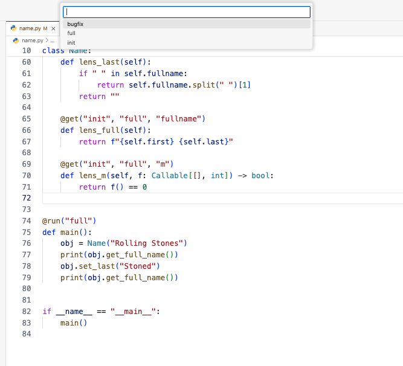

# Artifact for a Language-Based Version Control System

Please answer the following questions concisely, either with bullet lists or short paragraphs.

Title of the submitted paper: A Language-Based Version Control System
ECOOP submission number for the paper: 108


## Quick-start guide

### Prerequisites
You should have Docker installed on your machine and at least 2GB of free space.

### Installation
Run the Docker image and bind port `8443` of the container to an available port (e.g. `8080`) on your machine:

```bash
docker run -p 0.0.0.0:8080:8443 ecoop108/vpy:latest
```

## Usage
After the container is running, open your web browser and go to `localhost:8080`. This should open a VS-Code editor with the examples loaded and the extension installed.

Open one of the examples (e.g. `name.py`) and then click on Version Explorer on the left sidebar. You need to click the Refresh icon after opening a new file.


The extension allows you to manage the version graph:
- You can see replacement versions (commits) and upgrade versions (branches).
- You can edit a snapshot of a version by clicking the pencil icon (Edit) next to its name.
- You can project a slice for that version by clicking the document icon (Project slice) next to its name.

As an alternative to the Version Explorer panel, you can also use the **vpy: Project slice...** command available in the command palette. This command will prompt you to select a version from the graph of the current file and then will generate the slice for that version. 




You also have the compiler, `vpy`, available system-wide in the container. To check its usage, run the following command in the terminal panel:

```bash
vpy --help
```

Error reporting is integrated into the extension. Type errors show in the bottom panel (Problems) and also when you hover your cursor over a line marked with error (red underline).


To run the client code of the current file (e.g. function `main` in file `name.py`), open the **Run & Debug** browser on the left sidebar and select the **Python: Current File** run configuration, or, if no configuration exists yet, clicking on **Run and Debug > Python Debugger > Python File**, and then press the green arrow.


The output is displayed in the bottom Terminal panel. If you wish to inspect the code, you can add a breakpoint in the main function.

## Overview: What does the artifact comprise?

- Compiler for versioned python programs
- Extensions for managing versioned programs, accessible through the left-side panel or the command palette.


## For authors claiming an available badge

We agree to publish this under a Creative Commons license.

## For authors claiming a functional or reusable badge

The examples, which are available in the default workspace in the web editor, reproduce the claims in the paper.

Each example file has instructions on how to reproduce the claims in the paper.

The examples are self-contained. In some cases, the reviewer might want to make
manual changes to test out the results. These are indicated in comments and
should be easy to follow from the paper.

The structure of the examples is in the `README` file available inside the container, in the root of the (default) workspace of the web editor.

## For authors claiming a reusable badge

The implementation is open source and available on GitHub.

The project follows the `pyproject.toml` build system. To install, run with:

~~~bash
pip install <repository>
~~~
