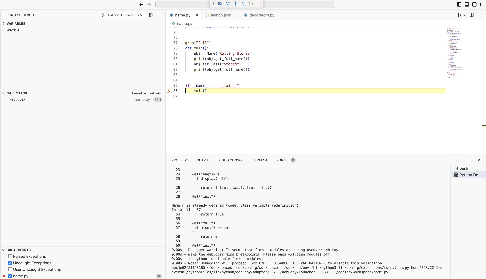

# Artifact for a Language-Based Version Control System

Please answer the following questions concisely, either with bullet lists or short paragraphs.

Title of the submitted paper: A Language-Based Version Control System
ECOOP submission number for the paper: 108


## Quick-start guide (Kick-the-tires phase)

### Prerequisites
You should have Docker installed on your machine and at least 2GB of free space.

### Installation
Clone this repository locally to your machine and `cd` to its directory:

```bash
git clone https://github.com/ecoop108/ecoop-artifact.git
cd ecoop-artifact
```

**Optional**: build the Docker image:

```bash
docker build -t ecoop108/vpy:latest .
```

Alternatively, you can pull the image from DockerHub (`ecoop108/vpy:latest`).

Run the Docker image and bind port `8443` of the container to an available port (e.g. `8080`) on your machine:

```bash
docker run -p 0.0.0.0:8080:8443 ecoop108/vpy:latest
```

## Usage
After the container is running, open your web browser and go to `localhost:8080`. This should open a VS-Code editor with the examples loaded and the extension installed.

Open one of the examples (e.g. `name.py`) and then click on the extension (Version Explorer) on the left sidebar. You may need to click the Refresh icon after opening a new file.


The extension allows you to manage the version graph:
- You can see replacement versions (commits) and upgrade versions (branches).
- You can add replacement or upgrade versions by right-clicking on a version name.
- You can edit a snapshot of a version by clicking the pencil icon (Edit) next to its name.
- You can project a slice for that version by clicking the document icon (Project slice) next to its name.

You also have the compiler, `vpy`, available system-wide in the container. To check its usage, use the command:

```bash
vpy --help
```
Error reporting is not (yet) integrated into the extension. If you write a program that produces errors, you are unable to see the error in the editor. Instead, you can open the terminal in the editor and run the command:

```bash
vpy -i <file> -t <target>
```

To run the client code of the current file (e.g. function `main` in file `name.py`), open the **Run & Debug** browser on the left sidebar and select the **Python: Current File** run configuration, then press the green arrow.  




## Overview: What does the artifact comprise?

- Compiler for versioned python programs
  - Codebase is at `/vpy` in the container.
- Extensions for managing versioned programs
  - Accessible through the left-side panel, as described earlier.


## For authors claiming an available badge

We agree to publish this under a Creative Commons license.

## For authors claiming a functional or reusable badge

The examples, which are available in the default workspace in the web editor, reproduce the claims in the paper.

Each example file has instructions on how to reproduce the claims in the paper.

The examples are self-contained, but action is needed to reproduce the errors/results (e.g. run the compiler). In some cases, the reviewer might want to make manual changes to test out the results. This should be easy to follow from the paper.

## For authors claiming a reusable badge

The implementation is open source and available on GitHub.

The project follows the `pyproject.toml` build system. To install, run with:

~~~bash
pip install <repository>
~~~
